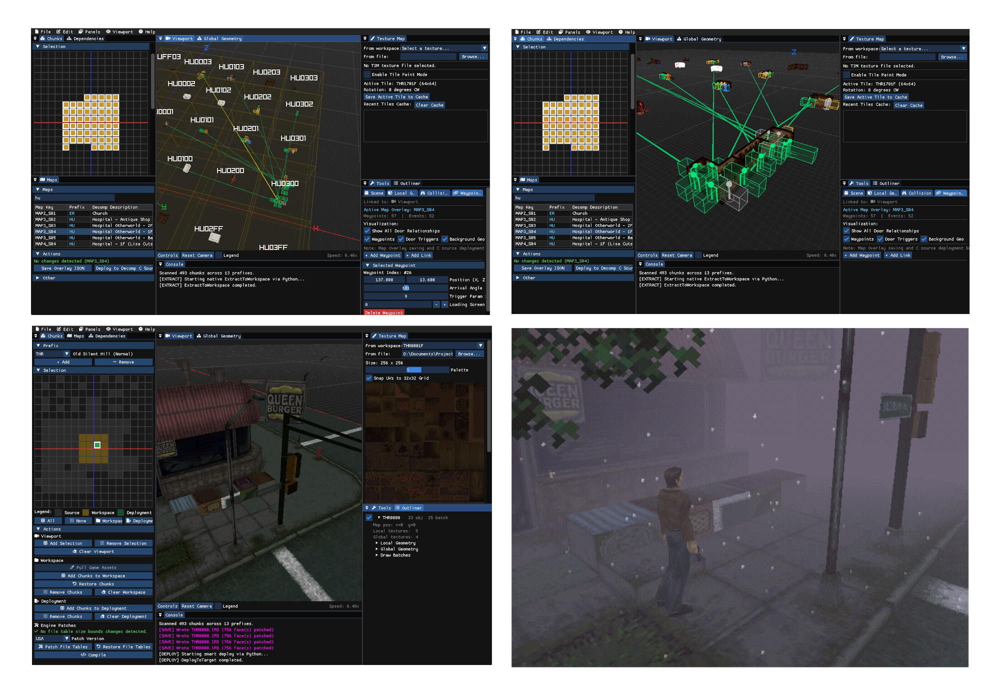

# SH1 Level Editor 

> [!NOTE]
> **This project is in very early development!** Most features have not yet been implemented and serious level editing is not recommended at this stage.

A C++ 3D geometry and level workstation for PlayStation 1 *Silent Hill* (1999) and its [unofficial PC Decompilation Port](https://github.com/SlickAmogus/silent-hill-decomp). Includes Python scripts that reproducibly convert proprietary formats (`.IPD`, `.PLM`, `.TIM`) **forwards and backwards!**

In the project's current state, proprietary chunk formats (`.IPD`, `.PLM`) have been **successfully mapped out** and are **convertible** through either the dedicated ImGui editor or the included Python scripting. Parsers for these formats had existed and were importable in Blender or Noesis, but were not backwards convertible or dynamic around struct data size. Initial creation of these conversion tools centered around full-trip conversion and packing of game files into their original formats byte-to-byte exact from JSONs, which minimised uninterpretable raw binary data. **Direct in-memory editing** was later implemented to replace the JSON approach and takes place in the C++/ImGui editor, where geometry can be manipulated, added or removed while preserving file readability by the game engine. Modified chunk, texture/CLUT (`.TIM`) and UV data have been successfully written back into game files and are verified to be congruent with 3D viewport changes, and more advanced operations and verifications are included in the chunk editor. Geometry, UV maps and global object positioning are **editable**; collision data and textures are **viewable** in the editor and should be modifiable from within the level editor in the near future. Apart from chunk data, elements of **map-specific data** have been editable for the PC Port via C source code modification, such as points of interest, doors and waypoints, although those are unintuitive to edit currently.

There is still a lot of further testing required, as I cannot claim any part of this is perfect. Naturally, **the results are real** and the interface is mostly intuitive, but **significantly more work is required before any serious level design is possible**. Given the need for rapid development and the complexity of the task, I have used AI assistance for early prototyping, research and a bulk of the editor. That being said, I have guided the AI considerably in applying my comprehension of the game engine, map files and PC Port into both research and the editor itself. I am hoping to rewrite this from the ground-up without AI assistance eventually.

Applications of this may exist for the ongoing effort in developing the [PC Port](https://github.com/SlickAmogus/silent-hill-decomp) and extending the [overall decompilation project](https://github.com/shdecompilations/silent-hill-decomp), and of course with modding in general. As of August 2026, the decompilation project is mostly complete, but what is missing is full annotation and migration of binary overlay map data. 3D visualisation offered by the program may allow for cross-referencing between the binary layout and in-game points, as with camera occlusion objects or event handling in the PC Port. The chunk manager (2D grid on left panel) allows for aliases to be assigned easily, a 3D legend complements this, and the linkage between externally-placed rooms is viewable.



---

## Features

- **Viewport**: Billboarded axis labels, legend, customisable controls and wireframe.
    - **Local Geometry**: Faces (subdivision, extrusion, triangulation, gluing and UV mapping), vertices (adding faces, extrusion, removing duplicates), meshes (some rotation, mostly unimplemented), and instantiated global objects from PLM files (some rotation, positioning, duplication).
    - **Collision**: Viewer for collision walls, ramps, camera occlusion, subcell height map, only for IPD local geometry, editing will come later.
    - **Waypoints**: Map-specific arrangements for doors (linkage to other rooms/maps), edits C source code for PC Port, untested in-game.
- **Chunk Manager**: 2D viewer for workspace and game override management, assigning aliases to chunks, dynamic file table patching when adding new objects.
- **Outliner**: Lists meshes and global geometry objects.
- **Texture Map**: 2D selector for UV mapping, CLUT rows, texture file switching for selected faces, texture editing/importing will come later in a separate panel!
- **Maps**: Currently minimal but editable, works in tandem with Waypoints viewport mode.
- File management is automated based on chunk and prefix selection.

---

## Current status

- **Unimplemented level design features**: Some of the level design elements haven't been implemented yet as of August 2026, but the core geometry (`.IPD`, `.PLM`), textures (`.TIM`) and chunk-specific collision (`.IPD`) are visualised correctly. The source code is modular enough to allow for easy future extension, allowing for discrete panels to be added.
- **Unimplemented PSX support and binary overlay editing**: Only the PC Port has been integrated so far. No disc-image support currently exists, but this can be implemented relatively easily. For the PC Port, most of the engine patches (file table updates, waypoint data) are centered around replacing C source files (and indirectly DLLs) and regenerating a full PSX disc image takes several minutes. Conversion cycle back into binary overlays, alongside an alternate deployment routine would likely be necessary. Disc image checksums are virtually guaranteed to change after modification such that the [Silent Hill Map Examiner](https://github.com/ItEndsWithTens/SilentHillMapExaminer) plugin won't recognise the game as Silent Hill anymore.
- **Unimplemented Linux or macOS support**: Currently only built around Windows due to the PC Port.
- **Use of legacy Python scripts**: Some asset conversion operations currently rely on legacy Python scripts. These are fully functional but should be replaced with native C++ implementations in the future.

---

## Setup

### Prerequisites
- **CMake** (version 3.14 or newer)
- **C++17 compliant compiler** (MSVC 2019+ via [Visual Studio Community](https://visualstudio.microsoft.com/downloads/) with Windows 10/11 SDK, MinGW-w64, GCC 9+, or Clang 10+). Only MSVC has been tested in a clean virtual environment so far.
- **Python 3.8+** (required for asset extraction and conversion scripts). Soon to be deprecated from core editor.
- **Git** (required for dependencies and submodules)

All C++ dependencies ([Raylib](https://github.com/raysan5/raylib), [Dear ImGui docking branch](https://github.com/ocornut/imgui), and [rlImGui](https://github.com/raylib-extras/rlImGui)) are automatically fetched and built by CMake via `FetchContent`.

You can alternatively download executables from [Releases](https://github.com/msimonetto/sh1-level-editor/releases), embedded within folder structure and isn't entirely standalone given its use of Python scripts and management JSONs.

### Building the level editor

1. **Clone the repository:**
   ```bash
   git clone https://github.com/msimonetto/sh1-level-editor
   cd sh1-level-editor
   ```

2. **Configure with CMake and build the executable:**
   - Initial clean configuration (with dependencies): `cmake -S . -B build`
   - Incremental build: `cmake --build build` OR `ninja -C build`

### Integrating the PC Port

> **Assets not included.** This repository does not contain any copyrighted game assets or executables. You must supply your own legal copy of *Silent Hill* (USA PS1 or PC port).

To playtest your level edits directly in the [PC Port](https://github.com/SlickAmogus/silent-hill-decomp):

3. **Clone the PC Port into `game/PC/`**, initialise submodules, and build according to its instructions:
   ```bash
   git clone https://github.com/SlickAmogus/silent-hill-decomp game/PC
   ```

4. Edit the PC Port configuration (`game/PC/pc_port/build/config.cfg`) and set `allow_loose_files = 1` (and for diagnostic purposes, set `preload_chunks = 0` for in-game chunk reloading).

5. Place a legally obtained copy of your Silent Hill 1 disc image (`SLUS-00707.bin` or `SLUS_007.07`) into:
   `game/PC/pc_port/build/gamedata/SLUS-00707.bin`

6. **Configure editor paths:**
   In the editor under **Edit $\rightarrow$ Settings** (or via `config.ini`):
   - **Project Directory:** Set to `data/` (or your preferred workspace path containing `workspace/` and `assets/`).
   - **Game Directory:** Set to `game/` (points to `game/PC` and its override directory for deploying level edits).

---

## Contributing

Contributions are more than welcome. I've outlined some important project principles in [`CONTRIBUTING.md`](CONTRIBUTING.md). As a summary, the project itself is fairly modular/abstracted to allow for simultaneous and easy development of new panels.

---

## License & Third-Party Credits

### Project License
This project is licensed under the **GNU General Public License v3.0 (GPL-3.0-or-later)**. See the [`LICENSE`](LICENSE) file for the full license text.

### Third-Party Libraries
- **[Dear ImGui](https://github.com/ocornut/imgui)** (Docking Branch) — Copyright © 2014-2026 Omar Cornut (MIT License)
- **[Raylib](https://github.com/raysan5/raylib)** — Copyright © 2013-2026 Ramon Santamaria (@raysan5) (zlib/libpng License)
- **[rlImGui](https://github.com/raylib-extras/rlImGui)** — Copyright © 2024 Raylib-Extras / Jeffery Myers (MIT License)
- **[nlohmann/json](https://github.com/nlohmann/json)** — Copyright © 2013-2026 Niels Lohmann (MIT License)

### Credits
- [shdecompilations/silent-hill-decomp](https://github.com/shdecompilations/silent-hill-decomp) — Ongoing PS1 decompilation of Silent Hill.
- [SlickAmogus/silent-hill-decomp](https://github.com/SlickAmogus/silent-hill-decomp) — Ongoing PC Port based on PS1 decompilation.
- [belek666/sh_ipd2obj](https://github.com/belek666/sh_ipd2obj) — Local chunk data converter from `.IPD` to `.OBJ` with dependency tracking. Used extensively in early research for parsing and converting the IPD file format properly.