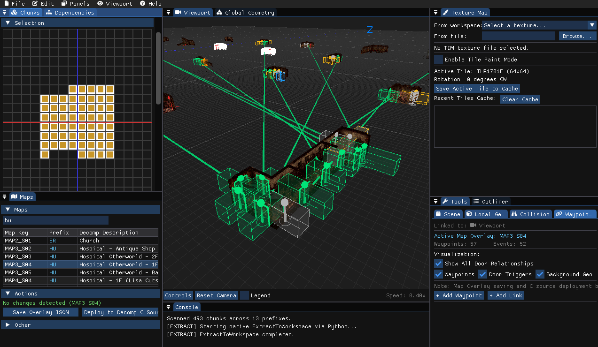

# Silent Hill Level Editor

A C++ 3D level editor, binary patcher and asset workstation for PlayStation 1 *Silent Hill* (1999) and its [PC Decompilation Port](https://github.com/SlickAmogus/silent-hill-decomp). The editor allows for intuitive conversion, inspection and modification of proprietary map formats (`.IPD`, `.PLM`, `.TIM`), binary overlays and room events data, while adhering to strict constraints imposed by the game engine and/or PSX hardware.

Draws heavily from the research of prior decompilation projects, and byte-exact binary conversion cycle that was achieved using Python scripts in previous experimentation. AI assistance has been used for prototyping, diagnostics and rapid development of the C++ GUI, with code having been carefully reviewed and directed thoroughly by user input. The GUI is built with [Raylib](https://www.raylib.com/) and [Dear ImGui](https://github.com/ocornut/imgui), featuring chunk and binary overlay managers, dependency tracking, local geometry and texture mapping tools, a global object manager and more. Future implementation will cover all elements of Silent Hill 1 level design; this project is currently a **work-in-progress**.



## Features & Capabilities

- **Asset Pipeline & Decomp Integration:** Automated toolchain for extracting game assets and deploying edits directly into the PC port override directories.
- **3D Viewport:** Real-time rendering and manipulation of chunk geometry (`.IPD`), global models (`.PLM`), object placements, and collision meshes with interactive camera controls.
- **Texture & TIM Manager:** Previewing, extraction, and palette (CLUT) inspection for PlayStation `.TIM` texture assets.
- **Room Linkages & Event Editor:** Visual representation and editing of door waypoints (`s_MapPoint2d`), trigger volumes (AABB/OBB), map indices, and room transition events (`s_EventData`).
- **IPD & Chunk Inspector:** Deep structural inspection and live editing of chunk headers, object matrices, positional groups, and other mapped out struct data.


## Current Limitations

- **Unimplemented PSX Support**: Only the PC Port has been integrated so far. No disc-image support currently exists, but this can be implemented relatively easily. Most of the engine patches (file table updates, waypoint data) are centered around replacing C source files (and indirectly DLLs) used by the PC Port. Conversion cycle back into binary overlays, alongside an alternate deployment routine would likely be necessary.
- **Unimplemented Linux or macOS Support**: Currently only built around the Windows PC Port.
- **Use of Legacy Python Scripts**: Some asset conversion operations currently rely on legacy Python scripts. These are fully functional but should be replaced with native C++ implementations in the future.
- **Missing Features**: Most of the level design elements haven't been implemented at this stage (August 2026), but a large chunk are visualised correctly (Local Geometry / Collision from IPDs, Global Objects from PLMs, Textures and Palettes from TIMs). The source code is modular enough to allow for easy future extension.

---

## Repository Structure

```
├── src/            # C++ implementation (core, viewports, panels, loaders)
├── include/        # C++ header files and data structures
├── docs/           # Reverse-engineering documentation, formats, and architecture
│   ├── formats/    # Detailed binary specs (IPD, Collision, Overlays, JSON)
│   ├── research/   # Verified FACTS.md and active HYPOTHESES.md
│   └── ARCHITECTURE.md # Overview of C++ subsystems and classes
├── scripts/        # Python asset extraction, conversion, and deployment toolchain
│   ├── core/       # Format parsers and conversion models
│   └── backend/    # Workspace management and decomp deployment helpers
├── game/           # Target game directory (PC port/disc workspace; game/README.md)
├── data/           # Local workspace data, extracted assets, and JSON representations
    ├── assets/     # Extracted assets (geometry, textures, etc.) from BINs
    ├── temporary/  # Temporary files, experiments, JSONs (regularly cleared)
    └── workspace/  # Current workspace data (IPD, PLM, TIM), highly important
└── tasks/          # Roadmap items, task logs, and implementation plans
```

---

## Building from Source

### Prerequisites
- **CMake** (version 3.14 or newer)
- **C++17 compliant compiler** (MSVC 2019+ via [Visual Studio Community](https://visualstudio.microsoft.com/downloads/) with Windows 10/11 SDK, MinGW-w64, GCC 9+, or Clang 10+)
- **Python 3.8+** (required for asset extraction and conversion scripts, soon to be deprecated)
- **Git** (required for dependencies and submodules)

All C++ dependencies ([Raylib](https://github.com/raysan5/raylib), [Dear ImGui docking branch](https://github.com/ocornut/imgui), and [rlImGui](https://github.com/raylib-extras/rlImGui)) are automatically fetched and built by CMake via `FetchContent`.

### Build Steps

1. **Clone the repository:**
   ```bash
   git clone https://github.com/msimonetto/sh1-level-editor
   cd sh1-level-editor
   ```

2. **Configure with CMake:**
   ```bash
   cmake -S . -B build
   ```

3. **Build the executable:**
   ```bash
   cmake --build build
   ```

   OR

   ```bash
   ninja -C build
   ```

4. **Launch the editor:**
   - **Windows (MSVC):** `.\build\Release\SilentHillLevelEditor.exe`
   - **Windows (MinGW / Ninja):** `.\build\SilentHillLevelEditor.exe`

### Platform Support
- **Windows (MSVC & MinGW):** Fully supported and verified.
- **Linux & macOS:** Planned for future releases.

---

## Game Setup & Workflow

> **Assets not included.** This repository does not contain any copyrighted game assets or executables. You must supply your own legal copy of *Silent Hill* (USA PS1 or PC port).

### 1. Linking with the PC Port
To playtest your level edits directly in the [PC Port](https://github.com/SlickAmogus/silent-hill-decomp):

1. **Clone the PC Port into `game/PC/`**, initialize submodules, and build according to its instructions:
   ```bash
   git clone https://github.com/SlickAmogus/silent-hill-decomp game/PC
   ```

3. **Enable Loose Files Override:**
   Edit the PC Port configuration (`game/PC/pc_port/build/config.cfg`) and set `allow_loose_files = 1`

4. **Provide Game Disc Data:**
   Place a legally obtained copy of your Silent Hill 1 disc image (`SLUS-00707.bin` or `SLUS_007.07`) into:
   `game/PC/pc_port/build/gamedata/SLUS-00707.bin`

5. **Configure Editor Paths:**
   In the editor under **Edit $\rightarrow$ Settings** (or via `config.ini`):
   - **Project Directory:** Set to `data/` (or your preferred workspace path containing `workspace/` and `assets/`).
   - **Game Directory:** Set to `game/` (points to `game/PC` and its `override/` directory for deploying level edits).

### 2. Extracting & Managing Assets
- Use the **Chunks Panel** inside the editor to extract, revert, and deploy chunks directly to the PC Port's override directories.
- Alternatively, use the Python toolchain in `scripts/` (such as `python scripts/convert.py --help`) to inspect and convert `.IPD`, `.TIM`, and `.PLM` assets.

---

## Documentation & Research

Detailed technical documentation and reverse-engineering findings are maintained in [`docs/`](docs/):
- [`docs/ARCHITECTURE.md`](docs/ARCHITECTURE.md) — Comprehensive technical map of the C++ codebase.
- [`docs/research/FACTS.md`](docs/research/FACTS.md) — Empirically verified binary data facts.
- [`docs/research/HYPOTHESES.md`](docs/research/HYPOTHESES.md) — Active reverse-engineering hypotheses and open questions.
- [`docs/formats/IPD.md`](docs/formats/IPD.md) — `.IPD` map chunk specification.
- [`docs/formats/Collision.md`](docs/formats/Collision.md) — Heightfield and wall collision structure specification.
- [`docs/formats/Binary Overlays.md`](docs/formats/Binary%20Overlays.md) — Memory overlay layouts and trigger data structures.
- [`docs/formats/JSON.md`](docs/formats/JSON.md) — Intermediate JSON representation schemas.

---

## Contributing

Contributions are welcome! Please review [`CONTRIBUTING.md`](CONTRIBUTING.md) for our research principles (evidence hierarchy, decomp citations), asset copyright policies, and coding standards.

---

## License & Third-Party Credits

### Project License
This project is licensed under the **GNU General Public License v3.0 (GPL-3.0-or-later)**. See the [`LICENSE`](LICENSE) file for the full license text.

### Third-Party Libraries
- **[Dear ImGui](https://github.com/ocornut/imgui)** (Docking Branch) — Copyright © 2014-2026 Omar Cornut (MIT License)
- **[Raylib](https://github.com/raysan5/raylib)** — Copyright © 2013-2026 Ramon Santamaria (@raysan5) (zlib/libpng License)
- **[rlImGui](https://github.com/raylib-extras/rlImGui)** — Copyright © 2024 Raylib-Extras / Jeffery Myers (MIT License)
- **[nlohmann/json](https://github.com/nlohmann/json)** — Copyright © 2013-2026 Niels Lohmann (MIT License)

### Acknowledgments & Credits
- **SlickAmogus** and **Vatuu** — *Silent Hill* PC port and PS1 decompilation projects (`silent-hill-decomp`) which serve as the foundation for engine logic and struct validation.
- **belek666** — Author of `sh_ipd2obj`, whose early reference converter aided in initial geometry format validation. Used extensively in early research for converting IPD file format properly.
- **Omar Cornut** and the Dear ImGui community for the immediate-mode GUI framework.
- **Ramon Santamaria** and the Raylib contributors for the 3D graphics and rendering library.
- The *Silent Hill* modding and reverse-engineering community.

---

### Legal Disclaimer
*Silent Hill* is a registered trademark of **Konami Digital Entertainment Co., Ltd.** This project is an independent, non-commercial research and authoring tool created by fans for modding and preservation purposes. It is not affiliated with, endorsed by, or sponsored by Konami.