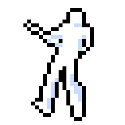
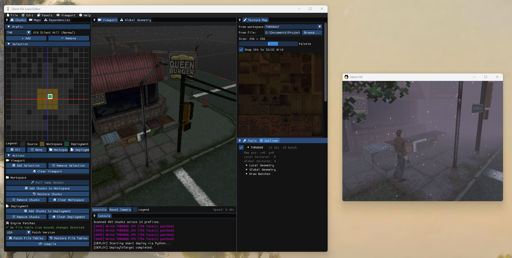

# SH1 Level Editor 

> [!NOTE]
> **This project is in early development!** Most features have not yet been implemented.

A C++ 3D geometry/level workstation for PlayStation 1 *Silent Hill* (1999) and its [unofficial PC Decompilation Port](https://github.com/SlickAmogus/silent-hill-decomp).

In its current state, proprietary chunk formats (`.IPD`, `.PLM`, `.TIM`) have been **successfully fully mapped out** and are **convertible** through either the dedicated ImGui editor or the included manual Python scripting. Recreating original game files byte-to-byte exact has been the core principle of this development, paving the way for in-memory editing that has been currently implemented. Modified chunk and texture data have successfully overridden game files in testing, and fully congruent to changes in the 3D editor. Elements of binary overlay data have been parsed and effective at producing valid C source files used by the PC Port, although most future extension will likely relate to binary overlay editing. The **2D Chunk Manager panel allows for effortless management and conversion of game files**, where name aliases can be set for obfuscated chunk names and a superimposed legend in the 3D Viewport maps these out clearly. Applications of this may exist for the ongoing effort in developing the PC Port and the overall decompilation project, and of course in modding.

Progress has been especially tied to the **ongoing decompilation project** for the exact structs and procedures used by the game engine, and additionally accelerated by the PC Port when testing for the requirements of valid chunk geometry. AI assistance has been fundamental for script prototyping, documentation, diagnostics and the rapid development of the C++ GUI, although code has been mostly reviewed and proofread with knowledge of the game engine, and each development step has been entirely user-supervised. I am hoping to rewrite this from the ground-up without AI assistance eventually.



---

## Features

- _Viewport_: billboarded axis labels, legend, customisable controls and wireframe
    - _Local Geometry_: faces (subdivision, extrusion, triangulation, gluing and UV mapping), vertices (adding faces, extrusion, removing duplicates), meshes (some rotation, mostly unimplemented), and instantiated global objects from PLM files (some rotation, positioning, duplication)
    - _Collision_: viewer for collision walls, ramps, camera occlusion, subcell height map, only for IPD local geometry, editing will come later
    - _Waypoints_: map-specific arrangements for doors (linkage to other rooms/maps), edits C source code for PC Port, untested in-game
- _Chunk Manager_: 2D viewer for workspace and game override management, assigning aliases to chunks, dynamic file table patching when adding new objects
- _Outliner_: lists meshes and global geometry objects
- _Texture Map_: 2D selector for UV mapping, CLUT rows, texture file switching for selected faces, texture editing/importing will come later in a separate panel
- _Maps_: currently minimal, works in tandem with Waypoints viewport mode

---

## Current Status

- **Unimplemented PSX Support**: Only the PC Port has been integrated so far. No disc-image support currently exists, but this can be implemented relatively easily. Most of the engine patches (file table updates, waypoint data) are centered around replacing C source files (and indirectly DLLs) used by the PC Port. Conversion cycle back into binary overlays, alongside an alternate deployment routine would likely be necessary.
- **Unimplemented Linux or macOS Support**: Currently only built around the Windows PC Port.
- **Use of Legacy Python Scripts**: Some asset conversion operations currently rely on legacy Python scripts. These are fully functional but should be replaced with native C++ implementations in the future.
- **Missing Features**: Most of the level design elements haven't been implemented at this stage (August 2026), but a large chunk are visualised correctly (Local Geometry / Collision from IPDs, Global Objects from PLMs, Textures and Palettes from TIMs). The source code is modular enough to allow for easy future extension.

---

## Setup

### Prerequisites
- **CMake** (version 3.14 or newer)
- **C++17 compliant compiler** (MSVC 2019+ via [Visual Studio Community](https://visualstudio.microsoft.com/downloads/) with Windows 10/11 SDK, MinGW-w64, GCC 9+, or Clang 10+). Only MSVC has been tested in a clean virtual environment so far.
- **Python 3.8+** (required for asset extraction and conversion scripts). Soon to be deprecated from core editor.
- **Git** (required for dependencies and submodules)

All C++ dependencies ([Raylib](https://github.com/raysan5/raylib), [Dear ImGui docking branch](https://github.com/ocornut/imgui), and [rlImGui](https://github.com/raylib-extras/rlImGui)) are automatically fetched and built by CMake via `FetchContent`.

You can alternatively download executables from [Releases](https://github.com/msimonetto/sh1-level-editor/releases), embedded within folder structure and isn't entirely standalone given its use of Python scripts and management JSONs.

### Building the Level Editor

1. **Clone the repository:**
   ```bash
   git clone https://github.com/msimonetto/sh1-level-editor
   cd sh1-level-editor
   ```

2. **Configure with CMake and build the executable:**
   - Initial clean configuration (with dependencies): `cmake -S . -B build`
   - Incremental build: `cmake --build build` OR `ninja -C build`

### Integrating PC Port

> **Assets not included.** This repository does not contain any copyrighted game assets or executables. You must supply your own legal copy of *Silent Hill* (USA PS1 or PC port).

To playtest your level edits directly in the [PC Port](https://github.com/SlickAmogus/silent-hill-decomp):

3. **Clone the PC Port into `game/PC/`**, initialise submodules, and build according to its instructions:
   ```bash
   git clone https://github.com/SlickAmogus/silent-hill-decomp game/PC
   ```

4. Edit the PC Port configuration (`game/PC/pc_port/build/config.cfg`) and set `allow_loose_files = 1` (and for diagnostic purposes, set `preload_chunks = 0` for in-game chunk reloading).

5. Place a legally obtained copy of your Silent Hill 1 disc image (`SLUS-00707.bin` or `SLUS_007.07`) into:
   `game/PC/pc_port/build/gamedata/SLUS-00707.bin`

6. **Configure editor paths:**
   In the editor under **Edit $\rightarrow$ Settings** (or via `config.ini`):
   - **Project Directory:** Set to `data/` (or your preferred workspace path containing `workspace/` and `assets/`).
   - **Game Directory:** Set to `game/` (points to `game/PC` and its override directory for deploying level edits).

---

## Contributing

Contributions are welcome. Please review [`CONTRIBUTING.md`](CONTRIBUTING.md) for research principles (evidence hierarchy, decomp citations, round-trip conversion). The project itself is fairly modular to allow for simultaneous development of new panels.

---

## License & Third-Party Credits

### Project License
This project is licensed under the **GNU General Public License v3.0 (GPL-3.0-or-later)**. See the [`LICENSE`](LICENSE) file for the full license text.

### Third-Party Libraries
- **[Dear ImGui](https://github.com/ocornut/imgui)** (Docking Branch) — Copyright © 2014-2026 Omar Cornut (MIT License)
- **[Raylib](https://github.com/raysan5/raylib)** — Copyright © 2013-2026 Ramon Santamaria (@raysan5) (zlib/libpng License)
- **[rlImGui](https://github.com/raylib-extras/rlImGui)** — Copyright © 2024 Raylib-Extras / Jeffery Myers (MIT License)
- **[nlohmann/json](https://github.com/nlohmann/json)** — Copyright © 2013-2026 Niels Lohmann (MIT License)

### Credits
- [shdecompilations/silent-hill-decomp](https://github.com/shdecompilations/silent-hill-decomp) — Ongoing PS1 decompilation of Silent Hill.
- [SlickAmogus/silent-hill-decomp](https://github.com/SlickAmogus/silent-hill-decomp) — Ongoing PC Port based on PS1 decompilation.
- [belek666/sh_ipd2obj](https://github.com/belek666/sh_ipd2obj) — Local chunk data converter from `.IPD` to `.OBJ` with dependency tracking. Used extensively in early research for parsing and converting the IPD file format properly.

---

### Legal Disclaimer
*Silent Hill* is a registered trademark of **Konami Digital Entertainment Co., Ltd.** This project is an independent, non-commercial research and authoring tool created by fans for modding and preservation purposes. It is not affiliated with, endorsed by, or sponsored by Konami.
