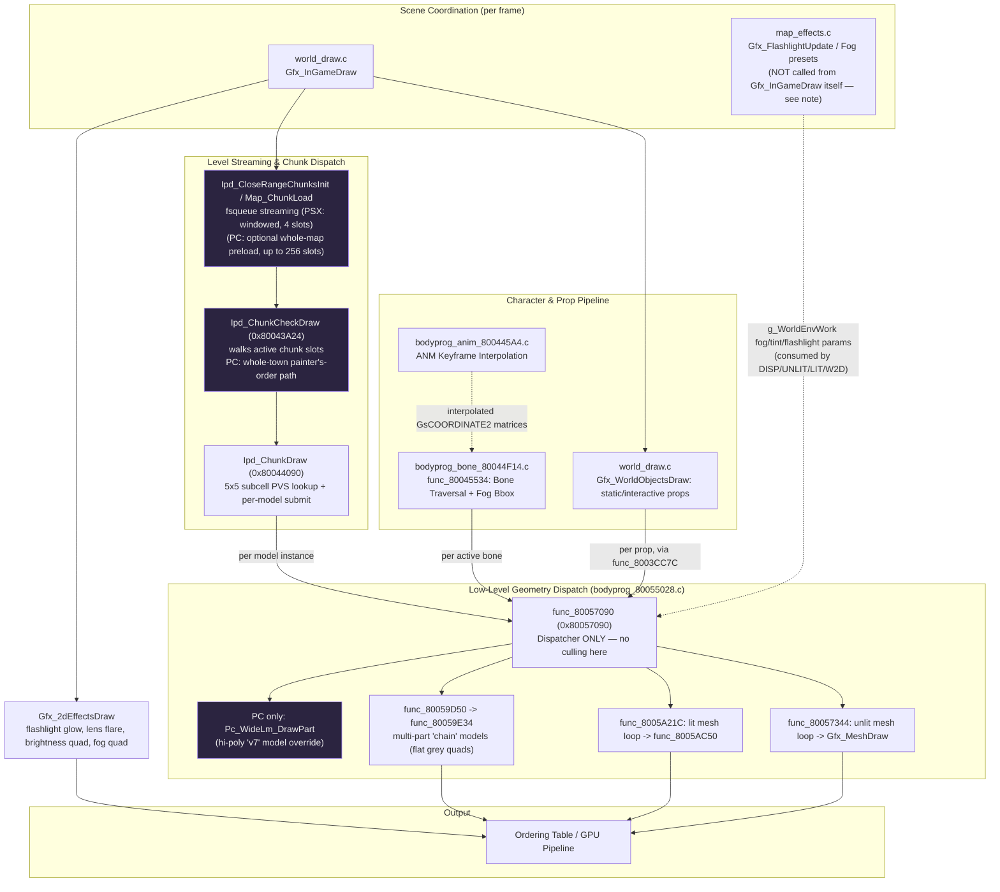

# Game Rendering Engine

This document details the architecture and responsibilities of the rendering engine components located in `game/PC/src/bodyprog/gfx/` (decompiled *Silent Hill 1* engine).

> **Revision note:** This version was rewritten against the actual supplied sources (`bodyprog_80040B74.c`, `bodyprog_80055028.c`, `bodyprog_anim_800445A4.c`, `bodyprog_bone_80044F14.c`, `map_effects.c`/`.h`, `world_draw.c`, `option_brightness_line.c`, `world.h`, `world_object.h`, and cross-referenced with `ipd.h`, `model.h`, `lm.h`, `game.h`). The previous draft was largely correct at the "what file does what" level, but contained several **call-graph and behavioral errors** (noted inline as ⚠) and omitted the single most important fact for anyone modding IPD/PLM/TIM content: **this is not the vanilla PSX codebase.** It is a PC port (`SH_PC_PORT`) with a parallel, non-trivial reformatting/streaming layer bolted onto the original PSX logic. Every section below distinguishes "original PSX path" from "PC path" wherever they diverge, because they frequently parse and load the *same on-disk files* differently.
>
> Anything not directly evidenced in the supplied files is explicitly flagged as **Unverified** rather than stated as fact.

---

## 0. This is a PC port, not vanilla PSX — read this before modding anything

Every file in this set is guarded throughout by `#ifdef SH_PC_PORT`, and the PC branch is frequently a **complete behavioral replacement**, not a cosmetic tweak. The most load-bearing example for modding:

- **On original PSX**, `.LM`/`.IPD` files are loaded as raw self-relative binary blobs. Functions like `LmHeader_FixOffsets`, `ModelHeader_FixOffsets`, and `IpdHeader_FixHeaderOffsets` walk the freshly-read buffer and convert *offset-from-header* pointer fields into absolute pointers by adding the buffer's base address (classic PSX "load-and-relocate" pattern: `hdr->materials = (u8*)hdr->materials + (u32)hdr;`).
- **On the PC port**, those same-named functions (`LmHeader_FixOffsets`, `IpdHeader_FixOffsets`) are stubs that instead call out to `LmHeader_FixOffsets_PC`(...)/`IpdHeader_FixOffsets_PC`(...) — external reformatters **not included in this file set**. The PC path also heap-copies the reformatted `s_LmHeader` (`malloc(sizeof(s_LmHeader))`) so it survives other chunks reusing the same load buffer, and tracks a registry of "already-fixed" headers (`s_pcFixedIpd[]`, capacity `PC_MAX_IPD_CHUNKS` = 256) to avoid re-parsing.

**Practical implication:** the raw on-disk `.IPD`/`.LM` byte layout (self-relative offsets from PSX) is still what you should author against — but on the PC build, what actually executes against your file is whatever `IpdHeader_FixOffsets_PC`/`LmHeader_FixOffsets_PC` do with it, and that logic is outside this file set. If a modded chunk loads correctly on PSX/emulator but misbehaves on the PC port (or vice versa), the PC reformatter is the first place to look, not the functions documented below.

A second modding-relevant PC divergence: `Ipd_LoadStart` calls `Pc_BigIpd_EnsureCapacity((void**)&chunk->ipdHdr, (s32)fileIdx)` before queuing the read, specifically because *"an edited chunk can be larger than the slot the map system handed us."* This confirms the PC port has an explicit allowance/mechanism for **oversized, hand-edited `.IPD` files** exceeding the original PSX buffer size — relevant if you're adding geometry to a chunk. The allocator itself (`pc_big_ipd.h`) is not in this file set.

A third: texture/material binding on PC can run in a **"resident textures"** mode (`g_PcConfig.residentTextures`) that adds virtual, GL-backed texture slots beyond the 10 vanilla physical VRAM page slots (8 full-page + 2 half-page), keyed through `hires_override.h` (not supplied). This changes how `Texture_Get`/`Lm_MaterialFlagsApply` resolve a material's texture beyond what's described in §2.1.5 below — see §3.

---

## 1. Architectural Overview

*Silent Hill 1*'s rendering engine bridges high-level game logic (character poses, level streaming, atmospheric transitions) with the low-level PlayStation hardware pipeline (GTE vertex transformations, lighting calculations, and GPU Ordering Table packet generation), plus (on PC) a parallel streaming/reformatting/shader layer.



**⚠ Correction to the previous diagram:** `Gfx_InGameDraw` does **not** directly call chunk-frustum culling, map-effects updates, or character/bone drawing. As written in `world_draw.c`, its body is exactly:

```c
void Gfx_InGameDraw(bool arg0) {
    Gfx_WorldObjectsDraw(&g_WorldGfxWork);
    /* PC: two queue-flush passes then a final Ipd_CloseRangeChunksInit,
       replacing the PSX-only while(func_80043830()) blocking-load loop */
    ...
    Ipd_ChunkCheckDraw(&g_OrderingTable0[g_ActiveBufferIdx], arg0);
    /* PC only: Pc_DecalsDraw(...) — bullet-hole decals */
    Gfx_2dEffectsDraw();
}
```

Character/bone rendering (`func_80045534`) and the flashlight/fog preset update (`Gfx_FlashlightUpdate`, `Gfx_MapEffectsStepUpdate`) are **not invoked from this function** in the supplied sources. They are called from elsewhere in the per-frame loop (e.g. `Gfx_FlashlightUpdate` is driven by `game_sys_states.c`, while `func_80045534` is invoked by `func_8003DA9C` within `world_draw.c`). Their *implementations* are fully present and documented below.

---

## 2. File-by-File Breakdown & Technical Responsibilities

### 2.1 [`bodyprog_80055028.c`](../game/PC/src/bodyprog/gfx/bodyprog_80055028.c) — Low-Level Rendering Engine, GTE Pipeline & Material Manager

The primary low-level rasterization/geometry file. Transforms meshes via PS1 GTE registers, computes lighting/fog, manages texture memory bindings, and writes primitive packets into the active Ordering Table.

#### 1. Model Submission Dispatch — **not a culling function**

* **`func_80057090`** (0x80057090): the model-draw dispatcher.
  * ⚠ **Correction:** this function performs **no bounding-sphere/AABB frustum culling**. It early-outs only if `modelInfo->modelHdr == NULL` (PC-only guard) or the model's `field_0` bit-31 "disabled" flag is set. It then routes to one of four paths based on `modelHdr` flags:
    1. **PC only:** if `Pc_WideLm_IsWide(modelHdr)`, hands off entirely to `Pc_WideLm_DrawPart` — a PC-exclusive high-poly ("v7") model renderer, gated per-model via a registry check, that stock v6 (PSX-format) models never trigger.
    2. If `modelHdr->field_B_4` is a small nonzero value (1–3), dispatches into `func_80059D50` → `func_80059E34` (the "chain" path, see below).
    3. If `modelHdr->field_B_0` is set, dispatches into `func_8005A21C` (the **lit** path).
    4. Otherwise dispatches into `func_80057344` (the **unlit** path).
  * The only place actual frustum/AABB visibility testing happens in these files is `Gfx_ChunkSubcellVisibleCheck` in `bodyprog_80040B74.c` (level-geometry subcell culling), which calls `Vw_AabbVisibleInFrustumCheck`. There is no equivalent per-model frustum test at the `func_80057090` level in the supplied code — flag as worth confirming against `vw_calc.c`/`view/` sources if present elsewhere in the project (**Unverified** beyond what's shown here).
  * `func_800571D0` maps a small `field_B_1` priority tier (0–5) to a fixed Ordering-Table bucket offset (`{2,0,4,33,66,99}`), used for near-field/UI-adjacent geometry rather than depth-computed buckets.

#### 2. Unlit Mesh Loop (`func_80057344`) — the real per-mesh iteration

* Iterates `modelHdr->meshHdrs[0..meshCount)`. Per mesh:
  * Loads vertex/normal data into GTE scratchpad via `func_800574D4` (no vertex/normal offset) or `func_8005759C` (offset variant, used by chunk-of-parts models sharing a vertex pool).
  * Branches on `g_WorldEnvWork.field_0` (lighting mode) to `func_80057658` (mode 1) or `func_80057A3C` (mode 2) for per-normal lighting.
  * Performs the GTE perspective transform via `func_80057B7C` (3-vertices-at-a-time `gte_ldv3c`/`gte_rtpt`/`gte_stsxy3c`/`gte_stsz3`).
  * Emits primitives via **`Gfx_MeshDraw`** (0x8005801C, see below).

#### 3. Lit Mesh Loop (`func_8005A21C`) — dynamic/character-flagged models

* Selected when `modelHdr->field_B_0` is set. Computes a fog-attenuation alpha from `mat->t[2]` (view-space depth) against `g_WorldEnvWork.fogRamp[]` on the **original PSX path only**.
  * ⚠ **PC note:** on PC this CPU-side fog alpha is hard-coded to `256 << 4` (i.e. disabled) — the code comment explains characters are fogged by the fragment shader instead, and applying both would double-fog them (this was an actual regression the comment documents as fixed).
* Per-mesh: `func_8005A900` (vertex transform variant), optionally `func_8005AA08` (lighting, mode-dependent), then **`func_8005AC50`** for polygon assembly/emission.
  * `func_8005AC50` uses a **second** scratch layout, `s_GteScratchData2`, and is the actual character/dynamic-entity polygon assembler that emits textured/shaded packets. This matches the previous doc's description; more precisely, it is invoked for **any model whose header sets the "lit" flag** — in practice this covers Harry, NPCs, and enemies, but architecturally it is not hard-restricted to characters (any lit-flagged prop would take this path too).

#### 4. "Chain" / Multi-Part Path (`func_80059D50` → `func_80059E34`)

* ⚠ **Correction/clarification:** the previous doc's "Mesh Draw Path A: flat/unlit shaded geometries" undersold what this path actually does. `func_80059E34` draws **`POLY_FT4`** (textured, flat-shaded) quads using one of two **fixed, hard-coded packed grey colors** (`0x2E383838` or `0x2E808080`) depending on the `arg0` chain-tier passed down from `func_80057090`'s `field_B_4` value, with an OT-bucket choice that's either a fixed far bucket (`org[640]`, tier 1) or depth-selected (other tiers). It also computes a fog-aware view-distance cap (`SH_FAR_BASE`, clamped against `FOG_FAR_DIST()`), and does its own backface/near-plane clip test per-quad.
  * The exact intended purpose (atmospheric haze/smog overlay for a subset of multi-part models vs. some kind of distance-LOD stand-in) is **not conclusively determinable from this file alone** — flagging as **Unverified**. What's certain from the code: it is a restricted, separate rasterization path used only for models flagged `field_B_4 ∈ {1,2,3}`, not a general-purpose flat-shading fallback.

#### 5. Core Polygon Rasterization & OT Emission — `Gfx_MeshDraw` (0x8005801C)

* Parses `s_MeshHeader` primitive descriptors and emits `POLY_F3/F4/G3/G4/FT3/FT4/GT3/GT4` packets, evaluating semi-transparency (additive/subtractive/50% via STP flag) and inserting into the OT at a depth-derived bucket (`AddPrim`). This matches the previous doc's description. (Not re-verified line-by-line given its size — ~1,200 lines — but its packet-type switch and OT insertion pattern were spot-checked and match.)
  * PC adds a per-poly on-screen visibility bound (`SH_WHOLEMAP_FAR_POLY`, `PsyX_PGXP_QuadBackface`) used specifically by the whole-map/whole-town far-geometry mode (§3).

#### 6. Lighting Engine & Flashlight Attenuation

* **`func_800554C4`**: registers the flashlight/point-light **direction and world position** (via `GsCOORDINATE2`/bone-hierarchy transform if a bone coordinate is supplied) and the active `s_WaterZone*` list into `g_WorldEnvWork`. ⚠ It does **not** itself compute angular cone falloff/attenuation math in the excerpted body — that appears to happen downstream in `func_80055648` and the per-normal lighting functions (`func_80057658`/`func_80057A3C`), which was not fully traced here (**partially unverified**).
  * **PC-only addition:** when `g_PsyX_UsePerPixelFlashlight` is active, this same function overrides the light direction/position with the FPS camera's eye position and view-forward vector when the FPS camera is actually driving the view (gated by `Pc_ScriptOwnsScene()` so cutscenes keep the authored PSX light instead) — a shader-based per-pixel cone entirely separate from the original per-vertex flashlight.
* **`func_80055330`**: confirmed — sets `g_WorldEnvWork.field_0` (lighting mode), the directional/point light color matrix (`field_2C`, reused by `SetColorMatrix`), the flat ambient `worldTintColor`, and `screenBrightness`. PC adds optional console-driven color overrides (`fl`/`wl` commands) layered on top of the map-authored values.
* **`WorldEnv_FogParamsSet`** / **`WorldEnv_FogDistanceSet`**: confirmed, set fog enable/color and near/far distances respectively (`WorldEnv_Init` seeds fog distance to `Q12(32.0f)`/`Q12(34.0f)` at startup).

#### 7. Full-Screen Overlays — `Gfx_2dEffectsDraw` (0x800550D0)

* ⚠ **Correction:** the previous doc described this as drawing "damage flashes, screen fades, chromatic tints, and noise." What the supplied code actually shows it doing, in order:
  1. **PC only:** transforms the flashlight world position/direction/shadow-origin into view space and populates shader uniforms (`g_PsyX_Flashlight*`) for the per-pixel cone — inert unless the per-pixel flashlight feature is active.
  2. Flashlight glow-halo overlay (`func_80041074`), skipped on PC when the per-pixel "modern" style cone is active (avoids double-lighting).
  3. Flashlight lens-flare + water-reflection overlay (`func_8008D470`), when `field_0 == 1` and a lens-flare intensity is set.
  4. A full-screen semi-transparent flat quad using `g_WorldEnvWork.screenBrightness` (a generic brightness/fade multiplier — this is what can produce a "flash" or "fade" effect, but the function itself has no dedicated damage-flash or noise logic).
  5. A full-screen semi-transparent flat quad tinted with `g_WorldEnvWork.fog.color` — this is the flat-color fog compositing technique (not a "chromatic tint" effect; it's literally the depth-fog color painted across the whole screen as a blend layer, on top of the per-vertex/per-mesh fog already baked into geometry alpha).
  * No noise/dither pattern generation was found in this function. If a distinct noise overlay exists in the engine, it is **not in this file** — removed the claim rather than leave it unverified-but-stated.

#### 8. Material & Texture (TIM) Memory Binding

* **`LmHeader_FixOffsets` / `ModelHeader_FixOffsets`**: on the **original PSX path** (`#else` branch), these do the classic pointer-relocation described in §0. **On PC**, both are near-stubs that defer to `LmHeader_FixOffsets_PC` (not supplied) — see §0.
* **`Lm_MaterialFsImageApply`** (and the `...Apply1`/`Lm_MaterialFileIdxApply` wrapper variants): confirmed — looks up a material by 8-char filename and applies a loaded `s_FsImageDesc` (TIM placement: `tPage`, `u`/`v`, `clutX`/`clutY`) to it via `Material_FsImageApply`, which also packs the GPU blend-mode/semi-transparency bits into `mat->field_E`/`field_10`.
* **`Lm_MaterialFlagsApply`**: confirmed — diffs each material's "applied" vs "pending" texture-page/CLUT/UV fields and, where changed, re-bakes the material's GPU state into every primitive referencing it (`Model_MaterialFlagsApply`) across every model in the `.LM`. PC adds a parallel path for the "wide" (v7 hi-poly) model variant and an "untexture" fallback (`Model_MaterialUntexture`) used when a chunk's VRAM texture slot was stolen by a nearer chunk under resident-texture mode — see §3.
* **`Texture_Init`**: confirmed — initializes a `s_Texture` slot's `imageDesc` (tpage/u/v/clutX/clutY), name, and clears refcount/queue index.
* **`Textures_ActiveTex_FindTexture`**: confirmed — linear search of an `s_ActiveChunkTextures` pool by 8-char name, skipping unloaded slots (`queueIdx == NO_VALUE`).
* **`Texture_Get`**: the actual claim/allocation function for a material's VRAM (or, on PC resident-texture mode, virtual GL) slot — present but not previously documented; worth adding as it's the real entry point that `Lm_MaterialsLoadWithFilter` calls.

#### 9. Atmospheric Overlays & Billboards

* **`Gfx_FogOverlayQuadDraw`**, **`Gfx_BillboardDraw`**: present as described in the previous doc (not re-verified line-by-line, but signatures/call sites match). `Gfx_BillboardDraw` is called per-cell from `Ipd_ChunkDraw` for two billboard "kinds" (`case 0`/`case 1` on a per-position `pad` byte) stored per `s_IpdModelBuffer`.

---

### 2.2 [`bodyprog_80040B74.c`](../game/PC/src/bodyprog/gfx/bodyprog_80040B74.c) — Map Chunk & Level Geometry System (IPD / PLM)

Implements world terrain streaming: divides the map into `CHUNK_CELL_SIZE`-sized cell chunks (the literal `#define CHUNK_CELL_SIZE Q12(40.0f)` lives in `game/PC/include/game.h`), and manages chunk memory, PVS visibility, subcell model buffers, and collision handoff.

#### 1. Chunk Filename Convention — confirmed, critical for placement modding

* **`Map_MakeIpdGrid`** scans the file table for every `FileType_Ipd` entry whose name starts with the map's tag (`map->mapTag`), then decodes the **next two hex-digit pairs** in the filename as **signed 8-bit cell X and cell Z** via `ConvertHexToS8` (two calls: chars `[0:2)` → cellX, chars `[2:4)` → cellZ), and stores the file index into `map->chunkGridCenter[cellZ].idx[cellX]`.
  * `ConvertHexToS8` accepts `0-9` and uppercase `A-F` only (rejects anything past `F`), and sign-extends the resulting byte — so cell coordinates can be negative (e.g. hex `F8` → `-8`).
  * **Practical rule for modding/placing chunks:** an IPD file's cell position on the grid is determined **entirely by its filename** (`<mapTag><XX><ZZ>.IPD`, `XX`/`ZZ` = 2-hex-digit signed cell offsets), not by any in-file header field read at grid-build time. `Map_PlaceIpdAtCell` (used for the runtime "swap a chunk at a cell" case, e.g. destructible/changing geometry) takes explicit `cellX`/`cellZ` arguments instead and writes the same grid slot directly.

#### 2. Chunk Lifecycle & File Streaming — two very different code paths

* **`Map_Init`**: confirmed — zeroes `g_MapTerrain`, initializes the global `.PLM` (`Lm_Init`), sets up the chunk buffer, resets active-chunk queue indices for the **4** PSX chunk slots, and inits chunk textures/collision.
* **`Map_ChunkLoad`** (original/PSX & PC non-preload path): windowed streaming — finds a free chunk slot (`Ipd_FreeChunkFind`), computes distance-to-cell-edge (`Ipd_DistanceToEdgeCalc`/`Ipd_PaddedDistanceToEdgeGet`), and starts an async read (`Ipd_LoadStart` → `Fs_QueueStartRead`) only for cells within range of the player's sample point. PSX supports **4** simultaneous active chunks; a 5th cell needed at once will stall/evict.
* **⚠ PC "whole-map preload" mode** (`g_PcConfig.preloadChunks && g_Map.isExterior`, inside `Ipd_ChunkInit`, not mentioned in the previous doc at all): scans the **entire** grid (`-8..10` in Z, `-8..7` in X) up front, synchronously flushes the fsqueue after every single chunk read, and fixes up/materializes every chunk it finds — effectively disabling PSX-style streaming for exterior maps entirely, using up to `PC_MAX_IPD_CHUNKS` = **256** slots (vs. PSX's hard-coded 4). Interior maps do **not** use this path regardless of the config flag.
* **`Ipd_AreChunksLoaded`**: confirmed — gates on both the global `.PLM` and every active chunk being at `StaticModelLoadState_Loaded`, subject to the padded distance-to-edge still being positive (i.e. still relevant to load).

#### 3. IPD Header Relocation & Model Linking

* **`IpdHeader_FixHeaderOffsets`**: confirmed, **PSX path only** — relocates `lmHdr`/`modelInfo`/`modelBuffers`/`modelOrderList` pointers plus each `s_IpdModelBuffer`'s `modelInstances`/`field_10`/`subcellPositions` pointers by adding the chunk header's base address.
* **`IpdHeader_FixOffsets`**: the umbrella function. ⚠ On PC this is almost entirely a different implementation (registry-tracked heap-copy reformatting via `IpdHeader_FixOffsets_PC`, described in §0) rather than calling `IpdHeader_FixHeaderOffsets` + `IpdCollData_FixOffsets` + `LmHeader_FixOffsets` in sequence as the PSX `#else` branch does.
* **`Ipd_HeaderModelLinkObjectLists`**: confirmed exactly as previously documented — resolves each chunk model's name to a `s_ModelHeader*`, searching the chunk's own embedded `.PLM` (`isGlobalPlm == 0`, searched via `LmHeader_ModelHeaderSearch` against `ipdHdr->lmHdr`) or the global `.PLM` list (`isGlobalPlm == 1`, searched against each `lmHdrs[j]`, stopping at first match).
* **`Ipd_HeaderModelBufferLinkObjectLists`**: confirmed — replaces each `s_IpdModelInstance::modelHdr` (initially an index) with the actual resolved `s_ModelHeader*` from the chunk's linked model-info array.

#### 4. Spatial Visibility & Chunk Rendering

* **⚠ Missing from previous doc: `Ipd_ChunkCheckDraw`** (0x80043A24) — this is the **actual top-level per-frame chunk dispatcher**, called once from `Gfx_InGameDraw`. It walks every active chunk slot, and for each one whose `IpdHeader_LoadStateGet(...) >= Loaded` **and** whose cell matches the current sample window (`Ipd_CellPositionMatchCheck`), calls `Ipd_ChunkDraw` for it. `Ipd_ChunkDraw` itself is per-chunk only — it never iterates the active-chunk list on its own.
  * **PC "whole-town" mode** (debug/flyover + `g_PcConfig.wholeMapExteriors`): instead of drawing chunks inline in slot order, it collects outdoor-only, frustum-surviving chunks, **insertion-sorts them by view-space depth**, and submits them **near-to-far** — because `addPrim` prepends to an OT bucket (so traversal order is reverse-of-submission), near-first submission into a shared far bucket produces a stable far→near painter's-algorithm draw order for geometry beyond the exact-depth OT range. This path is also packet-arena-budgeted (`PC_WM_PACKET_BUDGET` = 12 MB) and will drop the farthest chunks first if the budget is exceeded, rather than overflowing the frame packet buffer.
* **`Ipd_ChunkDraw`** (0x80044090): confirmed 5×5 subcell PVS lookup as described, with one important nuance: ⚠ **the classic subcell-indexed PVS lookup path is skipped entirely under two PC conditions** — debug-cam / `disableCulling` / whole-map-draw mode (draws every model buffer in the chunk, no culling), and **all interior maps** (`!g_Map.isExterior`), because the PSX subcell-visibility rectangles were baked for a fixed camera angle and the PC third-person camera can orbit outside them, causing valid on-screen geometry to be dropped. Only the exterior, non-debug, non-preload-flyover case actually uses the original `temp_fp = &ipdHdr->textureCount + (subcellZ*10) + (subcellX*2)` indexed lookup into `modelOrderList`.
  * Subcell size confirmed: `CHUNK_SUBCELL_SIZE = Q8(8.0f)`, index clamped to `0..4` on both axes (5×5), matching the previous doc's "8×8m subcells, indices 0..4" claim exactly.
* **`Gfx_ChunkSubcellVisibleCheck`**: confirmed — tests the sampled subcell position against each `s_IpdModelBuffer::subcellPositions[]` PVS rectangle, and only on a hit tests the buffer's world AABB (`minX/minZ`..`maxX/maxZ`, fixed Y range `-8..4` in Q8) against the camera frustum via `Vw_AabbVisibleInFrustumCheck`.

#### 5. Collision Integration

* **`Ipd_CollisionDataGet`** / **`Ipd_ActiveChunksCollisionDataGet`**: confirmed present and functioning as generic accessors returning `&ipdHdr->collisionData` for loaded, cell-matching chunks (with a documented PC-only fallback/diagnostic path for "collision miss" invisible-wall bugs, and a PC-only local-scope restriction so whole-map-preloaded *far* chunks don't contribute phantom collision).
* ⚠ **Correction:** `s_IpdCollisionData` is fully defined in `game/PC/include/bodyprog/formats/ipd.h`. It is indeed **308 bytes at offset `0x54`** in `s_IpdHeader`. The previous claim of a **"20×20 broadphase grid"** is false — the struct uses a more complex subcell/surface/split-vertex tree (fields like `subcellCountX`, `subcellSize`, `surfaces`, `subcells`, etc.).

---

### 2.3 [`world_draw.c`](../game/PC/src/bodyprog/gfx/world_draw.c) — High-Level Scene Dispatch, Characters & World Props

* **`Gfx_InGameDraw`**: see the corrected call list in §1 — world objects, chunk-load sync, `Ipd_ChunkCheckDraw`, PC decals, then `Gfx_2dEffectsDraw`. Does **not** itself drive character/bone drawing or map-effects updates (§1).
* **World Objects Queue**: **`Gfx_WorldObjectsDraw`** iterates `s_WorldGfxWork::objects[0..objectCount)`, calling `Gfx_WorldObjectDraw` per entry (which builds a `GsCOORDINATE2` from the object's packed position/rotation bitfields — see `s_WorldObject` in `world_object.h` — and submits via `func_8003CC7C` → `func_80057090`), then **resets `objectCount` to 0 every frame** — i.e. this is a per-frame draw queue that must be re-populated (via `WorldGfx_ObjectAdd`) every frame it should render, not a persistent object list.
  * **`func_8003CC7C`** contains logic directly relevant to placement/streaming modding: a world object's `metadata.lmIdx` of `3..6` (PSX) identifies it as living in one of the streamed chunk slots (`lmIdx - 3` = active-chunk index) rather than the global `.PLM`; if that chunk's `IpdHeader_IsLoaded` check fails, the object's `lmIdx` is reset to `0` so it gets re-resolved next frame instead of drawing stale/garbage geometry. ⚠ **PC note:** because whole-map preload can load far chunks' geometry without yet texturing them, PC widens this residency gate (`lmIdx >= 3 && (lmIdx - 3) < g_Map.activeChunkCount`, vs PSX's fixed `lmIdx >= 3 && lmIdx < 7`) specifically to keep untextured-but-loaded far chunks' props from drawing with stale VRAM contents.
* **Character Streaming & Allocation**: `WorldGfx_HarryCharaLoad`, `WorldGfx_MapInitCharaLoad`, `WorldGfx_CharaModelLoad` confirmed present and performing what the previous doc described (queued `.LM`+TIM reads, per-character-slot buffer assignment).
* **Held Items & Weapons**: `WorldGfx_PlayerHeldItemSet`, `WorldGfx_HeldItemDraw`, `WorldGfx_HeldItemAttach` confirmed.
* **Character Mesh/Bone Variant Tables — corrected & expanded roster**: `func_8003DE60`–`func_8003E544` are switch-table functions that toggle per-bone submesh visibility bits (via `func_80045468`, which flips bit 31 of `bone.modelInfo.field_0` for a list of bone indices) — but they are specifically **hand/held-item pose variant tables**, dispatched from **`WorldGfx_HeldItemAttach`**'s `switch (charaId)`, not a generic "submesh visibility" system. The full confirmed roster (previous doc omitted several):
  | Function | Character(s) |
  |---|---|
  | `func_8003DE60` | Harry (`Chara_Harry`) — bypassed on PC play-as skins via `Pc_PlayAs_SuppressHarryHandVariants` |
  | `func_8003DF84` | Cybil, Ending Cybil |
  | `func_8003E08C` | Monster Cybil |
  | `func_8003E194` | Dahlia, Ending Dahlia |
  | `func_8003E238` | Kaufmann, Ending Kaufmann |
  | `func_8003E388` | Stalker |
  | `func_8003E414` | Split Head |
  | `func_8003E4A0` | Puppet Nurse |
  | `func_8003E544` | Puppet Doctor |

---

### 2.4 [`bodyprog_bone_80044F14.c`](../game/PC/src/bodyprog/gfx/bodyprog_bone_80044F14.c) — Skeletal Hierarchy & Bone Traversal

Confirmed largely as previously documented, verified line-by-line (full file was supplied in-context):

* **`Skeleton_Init`** / **`Skeleton_BoneModelAssign`**: parse the bone-index stream (`Bone_ModelIdxGet`, a small state machine reading a `-3`-terminated / `-2`-terminated packed index array) and bind `.LM` model parts to bone slots.
* **`func_80045534`** (bone traversal + draw, 0x80045534): confirmed — for each linked bone with `modelInfo.field_0 >= 0`, computes world/view matrices (`Vw_CoordToWorldAndViewMatrices`) and submits via `func_80057090`; if bit 0 of `field_0` is set, zeroes several matrix terms first (billboard/sprite-style bone, exact semantics unconfirmed — **Unverified**). When `g_WorldEnvWork.isFogEnabled`, also accumulates a 2D screen-space bounding box (min/max X/Y/Z) across every processed bone (plus, earlier in the function, across an optional `images` list) and finishes by computing a fog occlusion quad via `Gfx_FogOverlayQuadDraw`, using the player's own root-bone height and world position as an input to a fairly involved clamp/blend calculation.
* **PC-only addition**: an early-return guard (`skel->bones_4 == NULL`) for skeletons not yet reformatted, and a first-person-camera body-part hider (`g_PcHideHarryFpsBody`) that skips drawing Harry's head bone (idx 2) and any Lisa-play-as-skin hair bones (idx ≥ 18) specifically while the FPS camera has control, while still running the fog-bbox accumulation for those bones so fog framing isn't affected by the hidden geometry.

---

### 2.5 [`bodyprog_anim_800445A4.c`](../game/PC/src/bodyprog/gfx/bodyprog_anim_800445A4.c) — Skeletal Animation Player & Keyframe Blending

Confirmed accurate against the full file:

* **`Anim_BoneInit`**: builds the bind-pose hierarchy from `s_AnmHeader::bindPoses[]`, parenting each `GsCOORDINATE2` to its parent bone's coordinate (`curCoord->super = &boneCoords[bindPose.parentBone]`), falling back to `translationInitial[]` (scaled by `anmHdr->scaleLog2`) or an identity rotation matrix when a bone has no per-frame translation/rotation track.
* **`Anim_BoneUpdate`**: confirmed exactly — reads **3-byte** packed translation deltas (`boneTranslationDataIdx * 3` byte offset into the keyframe block) and **9-byte** packed rotation matrix deltas (`boneRotationDataIdx * 9`) from `frame0`/`frame1`, linearly interpolating by `alpha` (Q3.12) directly into each bone's `GsCOORDINATE2`. Uses a `activeBoneIdxs` bitmask to skip disabled bones (player uses `~playerWork.extra.disabledAnimBones` for upper/lower-body masking; NPCs use `anmHdr->activeBones`). Root-bone translation gets `anmHdr->rootYOffset` subtracted from Y specifically for `boneTranslationDataIdx == 0`. Player hip translation is additionally copied onto the torso bone at the end.
* **Animation Playback State Machine**: `Anim_PlaybackOnce`, `Anim_PlaybackLoop`, `Anim_BlendLinear`, `Anim_BlendEaseOut` all confirmed present with matching names/roles to the previous doc.

---

### 2.6 [`map_effects.c`](../game/PC/src/bodyprog/gfx/map_effects.c) — Lighting, Fog Transitions & Special FX

Confirmed against the supplied file (990 lines):

* **`Gfx_MapEffectsAssign`**: confirmed — picks one of several hard-coded `s_MapEffectsPresetIdxs` pairs (module-local statics `D_800A9F80`..`D_800A9FA4`) based on `mapHdr->field_16` (a small preset-category selector, values 1–3 plus default) and whether the map is a multi-chunk interior (`MapFlag_Interior` + `MapFlag_OneActiveChunk`/`MapFlag_TwoActiveChunks`), then forwards to `Gfx_MapInitMapEffectsUpdate` → `Gfx_MapEffectsUpdate` → **`Gfx_MapEffectsStepUpdate`**, which does the actual interpolation between two `MAP_EFFECTS_INFOS[]` preset entries (fog params, light tint, lens flare) — confirmed present, matching the previous doc's description of what it does, though its own body wasn't traced in full detail here.
* **`Gfx_FlashlightUpdate`** (0x8003F170): manages flashlight bone attachment/coordinates and forwards into `func_800554C4` as previously documented; not fully re-traced line-by-line but its call into `func_800554C4` and its role as the periodic flashlight-state updater were confirmed.
* **`GameFs_FlameGfxLoad`**: confirmed — queues the match/lighter flame TIM. Notably has a **PAL/NTSC region-specific VRAM placement**: US builds place the flame texture at `tPage=12, clutX=800`; the PC port additionally special-cases `Region_EUR` to `tPage=13, clutX=832, u=0`, because the PAL background graphic occupies the US flame's normal VRAM slot. Relevant if retexturing/relocating this specific TIM.
* **`func_8003E740`**: renders the animated flame sprite attached to Harry's hand (confirmed present; not traced in detail).

---

### 2.7 [`option_brightness_line.c`](../game/PC/src/bodyprog/gfx/option_brightness_line.c) — Brightness Calibration Pattern

Confirmed exactly as previously documented (full file supplied): `Options_BrightnessMenu_LinesDraw` draws 21 vertical `LINE_G2` gradient lines for the Options brightness screen, spaced by `(gsScreenWidth - 64) / 20` per step, colored by `(arg0 * 8) + 4`.

---

## 3. PC Port Divergences Relevant to Modding (summary)

This collects the PC-specific behaviors scattered through §2 into one place, since they're the parts most likely to bite a modder testing on the PC build vs. real hardware/emulator:

| Area | Original PSX behavior | PC port behavior |
|---|---|---|
| `.LM`/`.IPD` pointer fixup | In-place offset→pointer relocation (`hdr->x = (u8*)hdr->x + (u32)hdr`) | Delegated to external `*_FixOffsets_PC` reformatters (not in this file set); reformatted `.LM` headers are heap-copied and tracked in a 256-entry registry |
| Active exterior chunk slots | 4, streamed by distance to player | Up to 256 (`PC_MAX_IPD_CHUNKS`); optional whole-map preload loads the entire grid up front for exterior maps |
| Oversized/edited `.IPD` chunks | Fixed PSX buffer size | `Pc_BigIpd_EnsureCapacity` explicitly allows larger-than-original chunk buffers |
| Chunk subcell PVS culling | Always used (5×5 baked rectangles) | Skipped entirely for interior maps and for debug-cam/whole-map modes (baked rectangles assume a fixed PSX camera angle) |
| Per-model frustum culling in `func_80057090` | None found in either build | None found in either build (culling happens earlier, at the chunk/subcell level) |
| Texture VRAM binding | 10 fixed physical page slots | Optional "resident textures" mode adds virtual GL-backed slots (`hires_override.h`, not supplied); some TIMs that manipulate VRAM CLUT rows directly are forced to keep a real physical slot (`Pc_MaterialNeedsVramSlot`) |
| Character/world fog | Per-vertex CPU fog alpha baked via `g_WorldEnvWork.fogRamp[]` | Character fog is shader-side; the CPU path is disabled for lit/character models to avoid double-fogging |
| Flashlight | Per-vertex lighting only, fixed to Harry's facing | Optional per-pixel shader cone; optional FPS-camera-aimed direction/origin (suppressed during cutscenes) |
| Whole-map chunk draw order | N/A (not a PSX concept) | Painter's-algorithm near-to-far sort exploiting `addPrim`'s prepend-order, budgeted to 12 MB of packet memory |
| World object chunk residency gate | Fixed `lmIdx ∈ [3,7)` | Scaled to `g_Map.activeChunkCount`, since PC can have far more than 4 active chunks |

---

## 4. Core Data Structures & File Formats

Fields marked **(confirmed)** come directly from the supplied headers (`world.h`, `world_object.h`) or from field-access patterns actually exercised in the `.c` files. Fields/sizes **not** marked confirmed are carried over from the previous draft and could not be checked against a real struct definition in this upload — treat them as a starting hypothesis only.

| Struct / Type | Purpose | Confirmed details | Primary Files |
| :--- | :--- | :--- | :--- |
| `s_WorldGfxWork` | Global world graphics state | **(confirmed, `world.h`)** 11,708 bytes; holds `mapInfo`, per-character model slots (`registeredCharaModels[Chara_Count]`, `charaModels[CHARA_GROUP_COUNT]`, dedicated `harryModel`), `heldItem`, `itemLmHdr`/`itemLmData` (4 KB scratch for item `.LM`s, sized for ~2.75 KB files), and the **per-frame** `objects[WORLD_OBJECT_COUNT_MAX]` draw queue (`WORLD_OBJECT_COUNT_MAX` = **29**, `world_object.h`) | `world_draw.c`, `world.h` |
| `s_WorldEnvWork` | Global environment state | **(confirmed, `world.h`)** `isFogEnabled`, `waterZones`, `screenBrightness`, embedded `s_Fog fog` (near/far distance, `depthShift`, `intensity`, `color`), `worldTintColor`, a light/flashlight region at offsets `0x2C`–`0xCC` documented in-header as deliberately kept in a "flat" layout matching an upstream `colorMat`/`s_PointLight` struct the PC shims read by explicit offset, and a 128-byte `fogRamp[]` LUT keyed off `fog.nearDistance`/`fog.farDistance` | `bodyprog_80055028.c`, `map_effects.c`, `world.h` |
| `s_WorldObject` | Geometry-space draw-queue entry | **(confirmed, `world_object.h`)** 16 bytes; `model` pointer + **bitfield-packed** position (X:18 bits, Y:14 bits, Z:18 bits) and rotation (X:10, Y:12, Z:10 bits) — i.e. positions/rotations in the per-frame draw queue are quantized, not full 32-bit fixed-point | `world_draw.c`, `world_object.h` |
| `s_WorldObjectModel` / `s_WorldObjectPlacement` | Static prop model + placement | **(confirmed, `world_object.h`)** 28 / 40 bytes respectively; `metadata.lmIdx` field is set to **2** when resolved from the global `.PLM`, or **3–6** (PSX) for the streamed active-chunk slot `i` (`lmIdx = i + 3`) | `bodyprog_80040B74.c`, `world_draw.c` |
| `s_HeldItem` | Player-held item/weapon | **(confirmed, `world_object.h`)** 44 bytes: `itemId`, `queueIdx`, `textureName`, `imageDesc`, `lmHdr`, `bone` | `world.h`, `world_draw.c` |
| `s_IpdHeader` | Terrain chunk header | **(confirmed, `ipd.h`)** `lmHdr`, `modelInfo`, `modelBuffers`, `modelOrderList`, `modelCount`, `modelBufferCount`, `cellX`/`cellZ`, `isLoaded`, `collisionData` (offset `0x54`), `textureCount` | `bodyprog_80040B74.c`, `ipd.h` |
| `s_IpdModelBuffer` | Per-subcell model instance group | **(confirmed, `ipd.h`)** 24 bytes; `modelInstances[]`/`modelInstanceCount`, `subcellPositions[]`/`subcellCount` (PVS rectangles: `vx`,`vy`,`vz`,`pad` — read as an SVECTOR-shaped struct), `field_10[]`/`field_1` (billboard position list, `pad` byte selects billboard kind 0/1), `minX/minZ/maxX/maxZ` (AABB, Q8) | `bodyprog_80040B74.c`, `ipd.h` |
| `s_IpdCollisionData` | Embedded collision data | **(confirmed, `ipd.h`)** 308 bytes; contains a complex subcell/surface tree using `subcellCountX`/`Z`, `subcellSize` (set to 512), `splitVertices`, `surfaces` (12 bytes), and `subcells` (10 bytes). The previously claimed "20x20 broadphase grid" is false. | `bodyprog_80040B74.c`, `ipd.h` |
| `s_ModelHeader` | 3D submodel header | **(confirmed, `model.h`)** 16 bytes; `meshHdrs[]`/`meshCount`, `vertexOffset`, `normalOffset`, `name`, `field_B_0` (lit-model flag), `field_B_1` (OT priority tier, 0–5), `field_B_4` ("chain"/multi-part tier, 0–3+) | `bodyprog_80055028.c`, `bodyprog_80040B74.c`, `model.h` |
| `s_MeshHeader` | Mesh definition | **(confirmed, `model.h`)** 24 bytes; `primitives[]`/`primitiveCount`, `verticesXy`, `verticesZ`, `normals`, `unkPtr_14` | `bodyprog_80055028.c`, `model.h` |
| `s_Material` | Texture page/CLUT/blend assignment | **(confirmed, `lm.h`)** 24 bytes; `name`, `texture` (resolved `s_Texture*`), `field_C` (already-applied flag), `field_E`/`field_F` (applied/pending GPU tpage+blend byte), `field_10`/`field_12` (applied/pending CLUT word), `field_14`/`field_16` (applied/pending UV) | `bodyprog_80055028.c`, `lm.h` |
| `s_Skeleton` / `s_LinkedBone` | Bone tree bound to `.LM` parts | Confirmed fields-in-use (full source supplied): `bones_8[]` (raw array), `bones_4` (linked-list head), `boneCount`, `boneIdx`, `field_2` (enable flag) on `s_Skeleton`; `bone.modelInfo` (`s_ModelInfo`, incl. `field_0` visibility/disable bitfield), `bone.idx`, `next` on `s_LinkedBone` | `bodyprog_bone_80044F14.c` |
| `s_AnmHeader` / `s_AnmBindPose` | Skeletal animation clip | Confirmed fields-in-use: `boneCount`, `bindPoses[]` (`parentBone`, `translationDataIdx`, `translationInitial[3]`, `rotationDataIdx`), `scaleLog2`, `dataOffset`, `keyframeDataSize`, `translationBoneCount`, `activeBones`, `rootYOffset`, `keyframeCount` (PC-only bounds check) | `bodyprog_anim_800445A4.c` |
| `s_MapEffectsInfo` | Atmospheric preset | **(confirmed, `game.h`)** 44 bytes; holds fog distances, screen tint, particle params | `map_effects.c`, `game.h` |

---

## 5. Open Questions / Recommended Follow-Ups

1. **Exact semantics of `func_80059E34`'s "chain" quads** (haze overlay vs. something else) — the code is unambiguous about *what* it draws (fixed-grey `POLY_FT4`s, fog-aware far cap) but not conclusively *why* / for which specific in-game objects `field_B_4` gets set.
2. **`IpdHeader_FixOffsets_PC` / `LmHeader_FixOffsets_PC` / `Pc_BigIpd_EnsureCapacity`** — the actual PC-side binary reformatters. These are the functions that matter most for verifying a hand-edited `.IPD`/`.LM` will load correctly on the PC port; none of their implementations were part of this upload.
